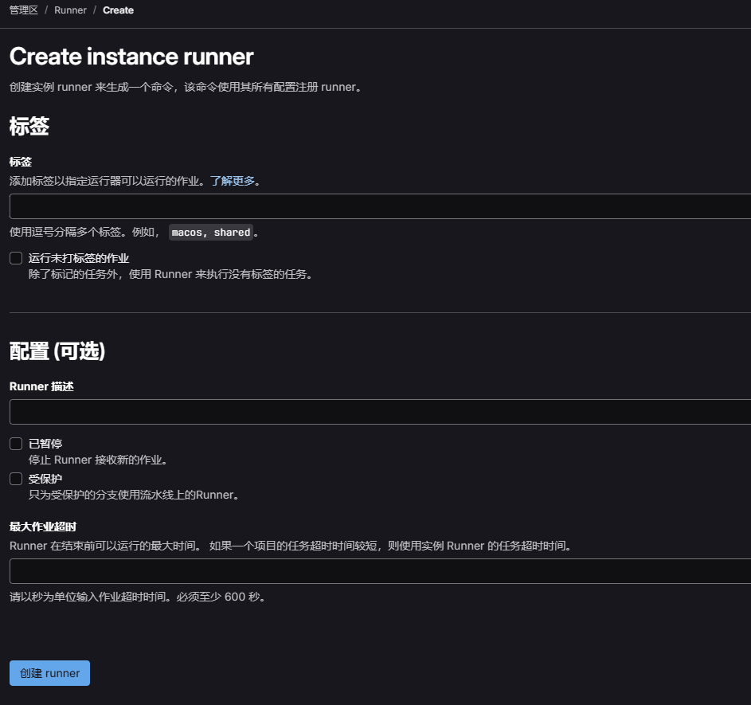
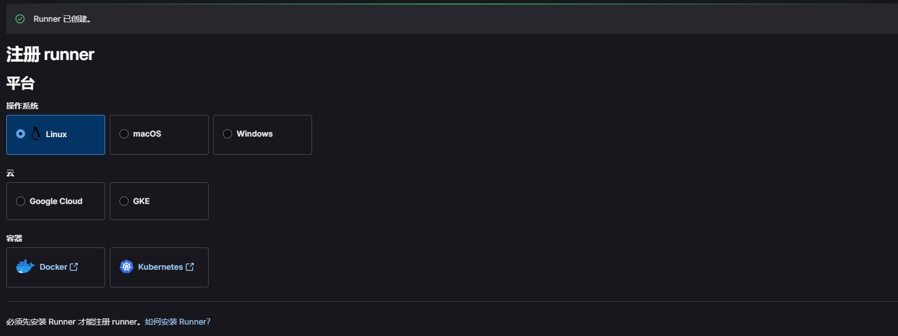

# GitLab 安装 Runner

> 本节将指导你完成 **安装 GitLab Runner** 的全过程

## 🎯 教学目标

通过本节学习，你将掌握：
- 如何部署 GitLab Runner（基于 Docker）；
- 如何注册 Runner 到 GitLab；
- 如何编写 `.gitlab-ci.yml` 工作流文件；
- 如何触发 CI/CD 流程；
- 如何理解和部署不同类型的 Runner。

## 📦 步骤说明

### 1. 环境准备

在开始之前，请确保满足以下条件：
- 已成功安装并运行 GitLab（建议版本 14.0 及以上）；
- GitLab 服务已开启 CI/CD 功能（默认开启）；
- 已创建一个普通项目用于测试 CI/CD。

### 2. 操作步骤

#### 2.1 安装 Runner

> ⚠️ 强烈推荐将 Runner 与 GitLab 分开部署，其中 Runner 最好使用 docker-compose.yml 来部署，方便维护。
>
> 注意：本教程环境基于 Linux，其他环境请查阅[官方文档](https://docs.gitlab.com/runner/install)

##### 2.1.1 Linux 二进制安装

1. 添加官方 GitLab 仓库：

   ```bash
   curl -L "https://packages.gitlab.com/install/repositories/runner/gitlab-runner/script.deb.sh" | sudo bash
   ```

2. 安装最新版本的 GitLab Runner，或跳过下一步安装特定版本：

   ```bash
   # Debian/Ubuntu/Mint
   sudo apt install gitlab-runner
   
   # RHEL/CentOS/Fedora/Amazon Linux
   sudo yum install gitlab-runner
   # 或者
   sudo dnf install gitlab-runner
   ```

3. 安装特定版本的 GitLab Runner：

   ```bash
   # Debian/Ubuntu/Mint
   apt-cache madison gitlab-runner
   sudo apt install gitlab-runner=17.7.1-1 gitlab-runner-helper-images=17.7.1-1
   
   # RHEL/CentOS/Fedora/Amazon Linux
   yum list gitlab-runner --showduplicates | sort -r
   sudo yum install gitlab-runner-17.2.0-1
   ```

4. [注册 Runner](https://docs.gitlab.com/runner/register/)

##### 2.1.2 Docker Compose 安装（强烈推荐）

1. 创建 Runner 的 Docker Compose 文件：

   ```yaml
   services:
     gitlab-runner-global-apple:
       image: gitlab/gitlab-runner:v18.0.2
       container_name: gitlab-runner-global-apple
       restart: always
       networks:
         - gitlab_default
       volumes:
         - ./runners/global/apple:/etc/gitlab-runner
         - /var/run/docker.sock:/var/run/docker.sock
     gitlab-runner-global-banana:
       image: gitlab/gitlab-runner:v18.0.2
       container_name: gitlab-runner-global-banana
       restart: always
       networks:
         - gitlab_default
       volumes:
         - ./runners/global/banana:/etc/gitlab-runner
         - /var/run/docker.sock:/var/run/docker.sock
   networks:
     gitlab_default:
       external: true
   ```

   > 💡 注意事项：
   > - `./runners/xxx/xxx:/etc/gitlab-runner` 是将 Runner 的配置挂载到宿主机目录
   > - 可以将配置挂载到一个路径，这将合并所有配置，实现集中管理
   > - 文件名可根据个人喜好命名，通常是 `docker-compose.yml`

2. 启动 Runner 服务：

   ```bash
   docker compose -f docker-compose.yml up -d
   ```

3. [注册 Runner](https://docs.gitlab.com/runner/register/)

---

#### 2.2 注册 Runner 到 GitLab

##### 2.2.1 Runner 类型介绍

Runner 启动后，需要注册到 GitLab 实例才能使用。根据作用范围，Runner 分为以下三种类型：

| 类型 | 说明 | 适用场景 |
|------|------|----------|
| 实例级 | 通用 Runner，可被所有项目使用 | 项目技术栈不复杂且项目不多时推荐使用 |
| 群组级 | 群组通用 Runner，可被群组内所有项目使用 | 不同技术栈可通过 tag 区分 |
| 项目级 | 项目定制 Runner，仅能被特定项目使用 | 特殊项目，粒度最细 |


参考资料：[什么是 Runner？](https://docs.gitlab.com/runner/)

##### 2.2.2 Runner 注册流程

> 💡 这里以实例级 Runner 作为示例，请注意这需要用户拥有管理员权限。

###### 2.2.2.1 进入 Runner 注册页面

1. 点击左上角 Icon 进入首页；
2. 点击侧边栏的管理员按钮；
3. 点击左侧 CI/CD -> Runner；
4. 点击右上角的「创建实例 Runner」按钮。



###### 2.2.2.2 配置注册信息

在注册页面需要配置以下信息：

- **标签（Tags）**：用来区分 Runner 的环境，例如如果 Runner 的运行时镜像中包含 Maven 和 Java，可以打上 `maven`、`java` 标签，便于匹配 Runner；
- **描述（Description）**：Runner 的描述信息；
- **最大作业超时时间**：Runner 在结束前可以运行的最大时间。如果一个项目的任务超时时间较短，则使用实例 Runner 的任务超时时间。一般设置为 1 小时或 10 小时，具体根据项目标准构建时长调整，防止作业卡住长时间占用 Runner。


例如图中所示，运行时容器包含 node、docker、git，因此添加了相应标签，超时时间设置为 1h，然后点击「创建 Runner」即可。

###### 2.2.2.3 执行 Runner 注册

1. 点击按钮后会进入注册页面：

   

2. 无论采用二进制还是 Docker 方式安装，这里都选择 Linux 平台；

3. 对于二进制安装，直接在服务器上执行注册命令即可；对于 Docker 安装，需要进入 Runner 的 Docker 终端执行注册命令；

4. 按照提示输入以下信息：
   - GitLab 实例 URL（左侧展示默认值，确认无误后直接回车）；
   - Runner 名称（可使用默认值或自定义名称）；
   - 选择执行器类型（通常选择 docker）；
   - 输入默认 Docker 镜像名称（根据实际运行时镜像名称填写）；

   输入完成后，Runner 应该就创建成功了。这里使用的是 docker 执行器，其他执行器类型略有不同。

###### 2.2.2.4 自定义 Runner 配置

注册完成后，需要配置 Runner 使用 Docker 执行器来运行作业。

注意事项：
- 对于 Docker Compose 部署的 Runner，可以在文件挂载的路径中找到配置文件；
- 对于二进制安装注册的 Runner，配置文件位于 `/etc/gitlab-runner` 目录下。

一个典型的 Runner 配置如下（实际可能包含更多配置项）：

```toml
[[runners]]
  name = "my-runner"
  id = 1
  url = "http://gitlab.example.com/"
  token = "your-token"
  executor = "docker"
  [runners.cache]
   MaxUploadedArchiveSize = 0
   [runners.cache.s3]
   [runners.cache.gcs]
   [runners.cache.azure]
  [runners.docker]
    tls_verify = false
    image = "alpine:latest"
    privileged = false
    disable_entrypoint_overwrite = false
    oom_kill_disable = false
    disable_cache = false
    # 这里很重要，需要将宿主机的 docker 和 runner 的 docker 关联
    volumes = ["/cache", "/var/run/docker.sock:/var/run/docker.sock"]
    pull_policy = ["if-not-present"]
    shm_size = 0
    # 这里也很重要，需要指定 helper_image
    helper_image = "gitlab/gitlab-runner-helper:x86_64-v[你的gitlab版本]"
```

配置完成后保存即可。

- 对于二进制安装的 Runner，运行以下命令重启服务：
  
  ```bash
  sudo systemctl restart gitlab-runner
  ```

- 对于 Docker 安装的 Runner，直接重启容器即可：

  ```bash
  docker restart <container-name>
  ```

---

#### 2.3 编写示例 CI/CD Pipeline

创建 `.gitlab-ci.yml` 文件：

```yaml
stages:
  - build
  - test
  - deploy

variables:
  MAVEN_OPTS: "-Dhttps.protocols=TLSv1.2 -Dmaven.repo.local=.m2/repository"
  MAVEN_CLI_OPTS: "--batch-mode --errors --fail-at-end --show-version"

before_script:
  - echo "Beginning of the pipeline"

build-job:
  stage: build
  script:
    - echo "Compiling the code..."
    - echo "Compile complete."

unit-test-job:
  stage: test
  script:
    - echo "Running unit tests..."
    - echo "Unit tests passed."

lint-test-job:
  stage: test
  script:
    - echo "Linting code..."
    - echo "Code linting passed."

deploy-job:
  stage: deploy
  script:
    - echo "Deploying application..."
    - echo "Application successfully deployed."
  only:
    - main
```

将代码推送到 GitLab 仓库以触发 CI/CD 流程。

---

### 3. 查看执行状态

1. 打开 GitLab 项目；
2. 点击左侧导航栏中的 "CI/CD" -> "Pipelines"；
3. 查看构建任务执行状态与日志。

---

## 🎥 视频教程

敬请期待

---

## ❓ 常见问题

### Q: GitLab 中没有 CI/CD 入口？

请检查以下几点：
- 确保 GitLab 版本为 14.0+；
- 确认 GitLab 配置中启用了 CI/CD 功能；
- 确保有足够的权限访问 CI/CD 设置。

---

> 本节内容遵循 Apache 2.0 协议，欢迎引用与转载，需保留原始署名。